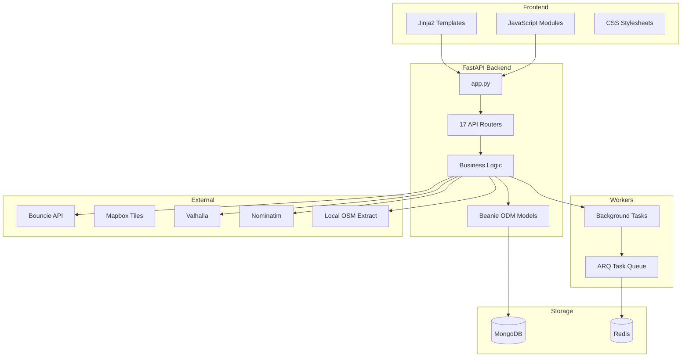

# EveryStreet Application Inventory

> **Generated**: January 16, 2026
> **Version**: 1.0.0
> **Location**: `/Users/davis/my-apps/everystreet-new`

---

## Executive Summary

**EveryStreet** is a full-stack web application for tracking driving coverage
across streets and geographic areas. The app integrates with Bouncie vehicle
tracking devices to fetch trip data, processes GPS coordinates via Valhalla map
matching, and visualizes street coverage on interactive maps.

| Metric           | Count               |
| ---------------- | ------------------- |
| Python Modules   | 53 root-level files |
| API Routers      | 17                  |
| HTML Templates   | 20                  |
| JavaScript Files | 129+                |
| CSS Files        | 38+                 |
| Database Models  | 15+                 |

---

## Technology Stack

### Backend

| Component          | Technology                 |
| ------------------ | -------------------------- |
| **Framework**      | FastAPI (async Python)     |
| **Database**       | MongoDB                    |
| **ODM**            | Beanie (async MongoDB ODM) |
| **Task Queue**     | ARQ (async Redis queue)    |
| **Python Version** | 3.11+                      |

### Frontend

| Component       | Technology                   |
| --------------- | ---------------------------- |
| **Templating**  | Jinja2                       |
| **Maps**        | Mapbox GL JS                 |
| **Build Tools** | Vite, TailwindCSS 4, PostCSS |
| **Linting**     | Biome, ESLint, Stylelint     |

### External Services

| Service           | Purpose                      |
| ----------------- | ---------------------------- |
| **Bouncie API**   | Vehicle tracking & trip data |
| **Mapbox**        | Map rendering (tiles/styles) |
| **Valhalla**      | Routing, map matching        |
| **Nominatim**     | Geocoding                    |
| **Local OSM Extract** | Street geometry data     |

---

## Application Architecture



---

## Core Modules

### API Routers (Registered in `app.py`)

| Router                       | Module                   | Purpose                      |
| ---------------------------- | ------------------------ | ---------------------------- |
| `pages_router`               | `pages.py`               | HTML page rendering          |
| `admin_api_router`           | `admin_api.py`           | Admin operations             |
| `analytics_api_router`       | `analytics/`             | Analytics data & reports     |
| `bouncie_webhook_api_router` | `bouncie_webhook_api.py` | Bouncie webhook handling     |
| `county_api_router`          | `county_api.py`          | County boundaries & data     |
| `coverage_api_router`        | `coverage_api.py`        | Street coverage endpoints    |
| `driving_routes_router`      | `driving_routes.py`      | Route calculation            |
| `export_api_router`          | `exports/`               | Data export (GeoJSON, Excel) |
| `gas_api_router`             | `gas/`                   | Gas/fuel tracking            |
| `live_tracking_api_router`   | `live_tracking_api.py`   | Real-time vehicle tracking   |
| `logs_api_router`            | `logs_api.py`            | Server log access            |
| `processing_api_router`      | `processing_api.py`      | Data processing endpoints    |
| `profile_api_router`         | `profile_api.py`         | User profile settings        |
| `search_api_router`          | `search_api.py`          | Search functionality         |
| `tasks_api_router`           | `tasks_api.py`           | Background task management   |
| `trips_router`               | `trips/`                 | Trip CRUD operations         |
| `visits_router`              | `visits/`                | Place visit tracking         |

---

### Feature Modules

#### `trips/` - Trip Management

| File           | Purpose                     |
| -------------- | --------------------------- |
| `routes/`      | API endpoints for trip CRUD |
| `services/`    | Trip business logic         |
| `models.py`    | Trip-related models         |
| `ingestion.py` | Trip data ingestion (25KB)  |
| `matching.py`  | GPS map matching (16KB)     |
| `stats.py`     | Trip statistics             |
| `worker.py`    | Background trip processing  |

#### `coverage/` - Street Coverage System

| File           | Purpose                                          |
| -------------- | ------------------------------------------------ |
| `models.py`    | `CoverageArea`, `Street`, `CoverageState`, `Job` |
| `ingestion.py` | OSM data ingestion                               |
| `matching.py`  | Trip-to-street matching                          |
| `events.py`    | Coverage event handlers                          |
| `routes/`      | Coverage API endpoints                           |

#### `gas/` - Fuel Tracking

| File        | Purpose                   |
| ----------- | ------------------------- |
| `routes/`   | Gas tracking API          |
| `services/` | Fuel economy calculations |

#### `analytics/` - Reporting & Insights

| File        | Purpose                     |
| ----------- | --------------------------- |
| `routes/`   | Analytics API endpoints     |
| `services/` | Data aggregation & analysis |

#### `visits/` - Place Tracking

| File        | Purpose                      |
| ----------- | ---------------------------- |
| `routes/`   | Visit API endpoints          |
| `services/` | Visit detection & management |

#### `exports/` - Data Export

| File                        | Purpose                     |
| --------------------------- | --------------------------- |
| `routes/`                   | Export API endpoints        |
| `services/export_writer.py` | GeoJSON/Excel generation    |
| `serializers.py`            | Data serialization          |
| `EXPORT_SPEC.md`            | Export format specification |

---

### Utility Modules

| Module                  | Purpose                                                        |
| ----------------------- | -------------------------------------------------------------- |
| `routes/`               | Shared route processing (core, geometry, graph, gaps)          |
| `trip_processor/`       | Trip processing pipeline (geocoding, map matching, validation) |
| `external_geo_service/` | External geo APIs (geocoding, map matching, rate limiting)     |
| `db/`                   | Database management (models, manager, migrations, aggregation) |
| `core/`                 | Core utilities (HTTP session, math, exceptions)                |
| `tasks/`                | Background task definitions                                    |

---

## Database Models (Beanie ODM)

### Core Collections

| Model         | Collection      | Description                   |
| ------------- | --------------- | ----------------------------- |
| `Trip`        | `trips`         | Raw trip records from Bouncie |
| `MatchedTrip` | `matched_trips` | Map-matched GPS coordinates   |
| `OsmData`     | `osm_data`      | Cached OSM data               |
| `Place`       | `places`        | Visited locations             |
| `TaskConfig`  | `task_config`   | Scheduled task configuration  |
| `TaskHistory` | `task_history`  | Task execution history        |

### Coverage Collections

| Model           | Collection       | Description                         |
| --------------- | ---------------- | ----------------------------------- |
| `CoverageArea`  | `coverage_areas` | Geographic coverage areas           |
| `Street`        | `streets`        | Static street geometry (from OSM)   |
| `CoverageState` | `coverage_state` | Dynamic coverage status per segment |
| `Job`           | `jobs`           | Background job tracking             |

---

## Frontend Structure

### HTML Templates (`templates/`)

| Template                   | Route           | Description              |
| -------------------------- | --------------- | ------------------------ |
| `base.html`                | -               | Base layout (39KB)       |
| `index.html`               | `/`             | Main map view            |
| `landing.html`             | `/landing`      | Landing page             |
| `trips.html`               | `/trips`        | Trip list & management   |
| `visits.html`              | `/visits`       | Place visits             |
| `coverage_management.html` | `/coverage`     | Coverage area management |
| `coverage_navigator.html`  | `/navigate`     | Route navigation         |
| `gas_tracking.html`        | `/gas`          | Fuel tracking            |
| `insights.html`            | `/insights`     | Analytics dashboard      |
| `settings.html`            | `/settings`     | App settings             |
| `profile.html`             | `/profile`      | User profile             |
| `export.html`              | `/export`       | Data export              |
| `vehicles.html`            | `/vehicles`     | Vehicle management       |
| `edit_trips.html`          | `/edit-trips`   | Trip editing             |
| `server_logs.html`         | `/logs`         | Server logs viewer       |
| `database_management.html` | `/database`     | Database admin           |
| `county_map.html`          | `/county`       | County boundary view     |
| `turn_by_turn.html`        | `/turn-by-turn` | Navigation directions    |
| `404.html`                 | -               | Not found page           |

### JavaScript (`static/js/`)

| Category         | Files             | Description            |
| ---------------- | ----------------- | ---------------------- |
| **Page Scripts** | 25                | Per-page functionality |
| **Modules**      | 92                | Reusable components    |
| **Settings**     | 13                | Settings page modules  |
| **Utilities**    | `utils.js` (38KB) | Shared utilities       |

Key modules:

- `live_tracking.js` (41KB) - Real-time vehicle tracking
- `coverage-management.js` (37KB) - Coverage area management
- `landing.js` (31KB) - Landing page with map
- `trips.js` (31KB) - Trip list management
- `gas_tracking.js` (29KB) - Fuel tracking UI

### CSS (`static/css/`)

| Category          | Files | Description            |
| ----------------- | ----- | ---------------------- |
| **Core**          | 4     | Base styles, variables |
| **Components**    | 10    | Reusable UI components |
| **Layout**        | 3     | Page layouts           |
| **Page-specific** | 21    | Per-page styles        |

Key stylesheets:

- `modern-map.css` (50KB) - Map styles
- `turn-by-turn.css` (25KB) - Navigation UI
- `coverage-navigator.css` (15KB) - Coverage navigation
- `landing.css` (15KB) - Landing page

---

## Background Tasks (`tasks/`)

| File             | Purpose                                |
| ---------------- | -------------------------------------- |
| `config.py`      | Task configuration & scheduling (12KB) |
| `fetch.py`       | Trip fetching from Bouncie (14KB)      |
| `maintenance.py` | Database maintenance tasks             |
| `coverage.py`    | Coverage calculation tasks             |
| `health.py`      | Health check tasks                     |
| `cron.py`        | Cron job definitions                   |
| `worker.py`      | ARQ worker configuration               |
| `registry.py`    | Task registration                      |
| `arq.py`         | ARQ pool management                    |

---

## Configuration

### Environment Variables

| Variable                        | Description                                                |
| ------------------------------- | ---------------------------------------------------------- |
| `MAPBOX_TOKEN`                  | Mapbox public access token (`pk.*`) for map rendering only |
| `VALHALLA_BASE_URL`             | Valhalla US9 base URL                                      |
| `VALHALLA_STATUS_URL`           | Valhalla status URL                                        |
| `VALHALLA_ROUTE_URL`            | Valhalla route URL                                         |
| `VALHALLA_TRACE_ROUTE_URL`      | Valhalla trace_route URL                                   |
| `VALHALLA_TRACE_ATTRIBUTES_URL` | Valhalla trace_attributes URL                              |
| `NOMINATIM_BASE_URL`            | Nominatim base URL                                         |
| `NOMINATIM_SEARCH_URL`          | Nominatim search URL                                       |
| `NOMINATIM_REVERSE_URL`         | Nominatim reverse URL                                      |
| `NOMINATIM_USER_AGENT`          | Nominatim User-Agent header value                          |
| `CORS_ALLOWED_ORIGINS`          | Comma-separated allowed origins                            |
| `PORT`                          | Server port (default: 8080)                                |

### Configuration Files

| File                 | Purpose                        |
| -------------------- | ------------------------------ |
| `config.py`          | Centralized API configuration  |
| `pyproject.toml`     | Python tooling (Ruff, Vulture) |
| `package.json`       | Node.js dependencies           |
| `biome.json`         | Biome formatter config         |
| `.eslintrc.json`     | ESLint config                  |
| `.stylelintrc.json`  | Stylelint config               |
| `docker-compose.yml` | Docker orchestration           |
| `Dockerfile`         | Container definition           |

---

## External Integrations

### Bouncie API

- **Auth**: OAuth 2.0 (credentials stored in MongoDB)
- **Endpoints**: Trip fetching, vehicle status
- **Webhook**: Real-time trip updates

### Mapbox APIs

- **Map Tiles**: Map rendering in browser

### Valhalla (self-hosted)

- **Routing**: Route calculation
- **Map Matching**: GPS trace to road network

### Nominatim (self-hosted)

- **Geocoding**: Forward/reverse lookup

### Local OSM Extract (self-hosted)

- **OSM XML Extract**: Street geometry source for coverage/graphs (OSM_DATA_PATH)
- **Data Types**: Roads, boundaries

---

## Development Tools

### Python Tooling

- **Ruff**: Linting & formatting (extensive rules in `pyproject.toml`)
- **Vulture**: Dead code detection
- **Target**: Python 3.11+

### JavaScript Tooling

- **Biome**: Formatting & linting
- **ESLint**: Additional linting
- **Vite**: Build tool
- **TailwindCSS 4**: CSS framework

### Testing

| File                                | Type             |
| ----------------------------------- | ---------------- |
| `tests/test_config.py`              | Config tests     |
| `tests/test_exports_jobs.py`        | Export job tests |
| `tests/test_exports_serializers.py` | Serializer tests |
| `tests/profile_state.test.js`       | JS unit tests    |

---

## Deployment

### Docker

```bash
# Build
docker build -t everystreet .

# Run with compose
docker-compose up
```

### Development

```bash
# Mac development script
./dev-mac.sh

# Start server
python app.py
# or
uvicorn app:app --reload
```

---

## Key Observations

### Strengths

1. **Clean modular architecture** - Feature modules with clear separation
2. **Async-first design** - FastAPI + Beanie + ARQ for high performance
3. **Comprehensive coverage tracking** - Full street-level coverage system
4. **Rich admin interface** - Server logs, database management, task monitoring

### Areas for Consideration

1. **Large frontend files** - Some JS files are 30-40KB
2. **Limited test coverage** - Only 4 test files found
3. **Single-user design** - No multi-tenancy (credentials stored directly)

---

_This inventory was auto-generated by analyzing the codebase structure._
